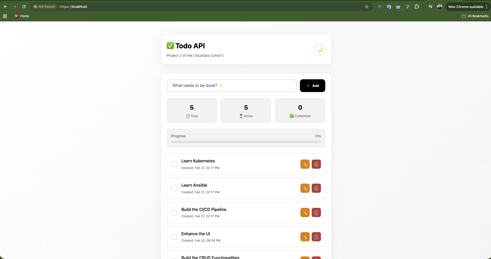
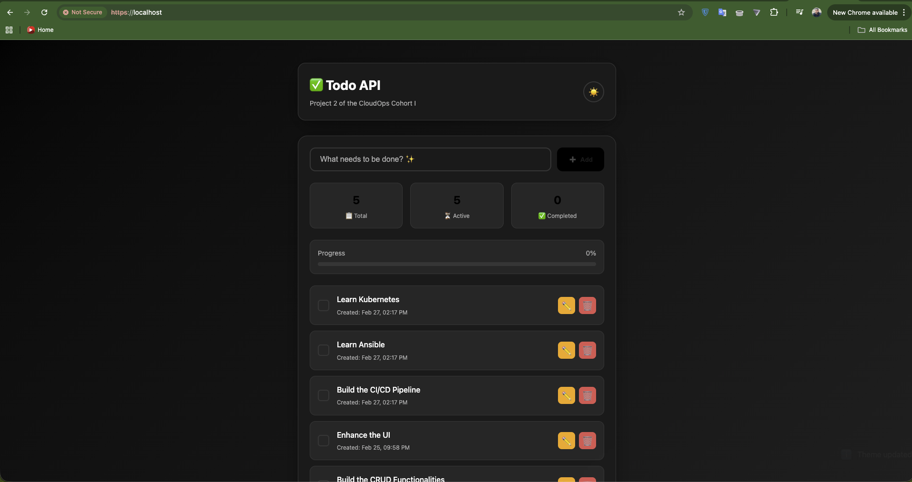
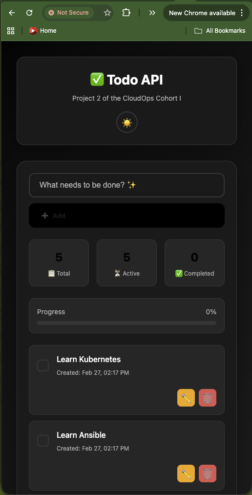
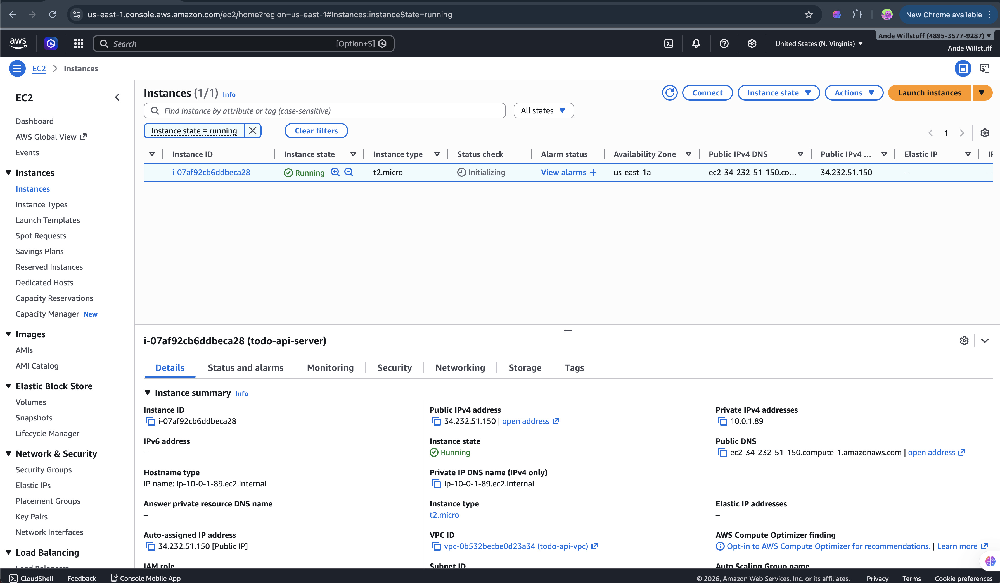
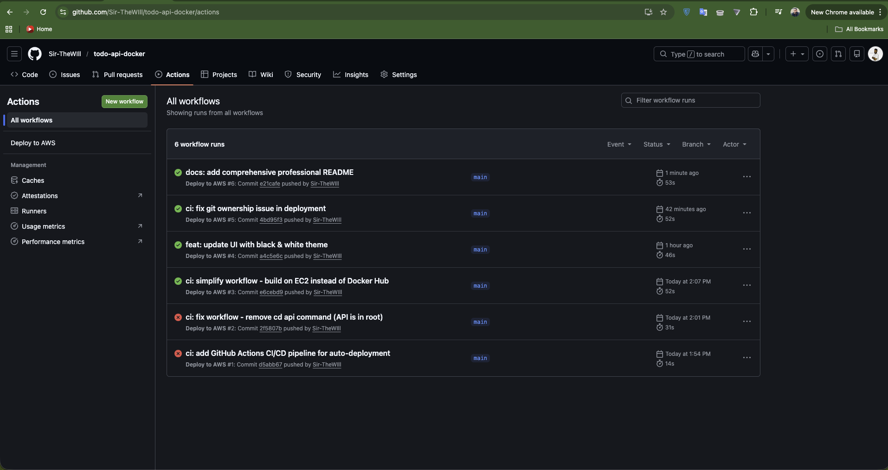
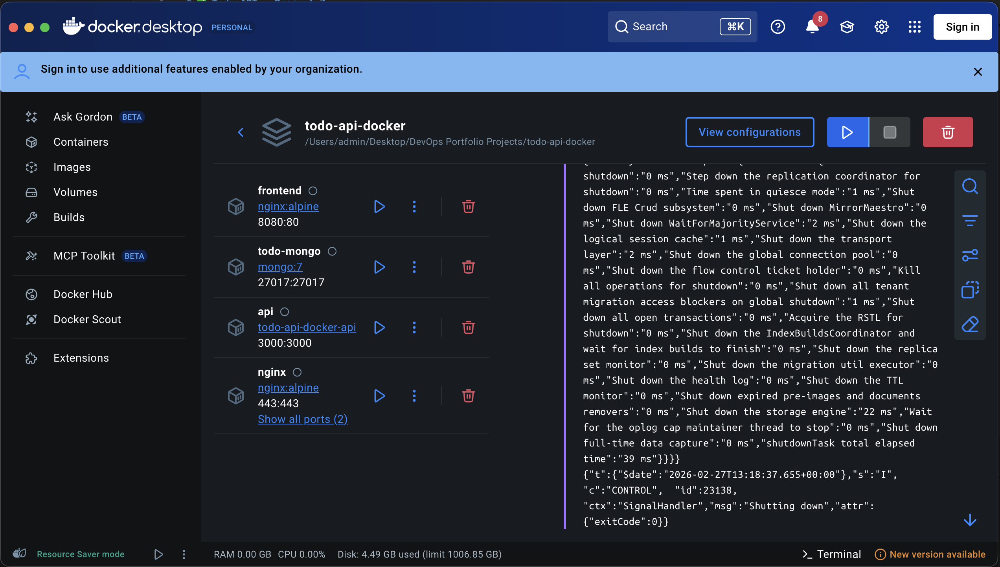

# ✅ Todo API - Project 2

[](https://github.com/Sir-TheWILL/todo-api-docker/actions/workflows/deploy.yml)
[](https://hub.docker.com/r/sirthewill/todo-api)
[](https://opensource.org/licenses/MIT)

> **Project 2 of the CloudOps Cohort I** - Full-stack Todo API with Docker, AWS, Terraform, Ansible, and CI/CD

### 🌐 Live Demo: [https://34.232.51.150.sslip.io](https://34.232.51.150.sslip.io)

## 📖 Overview

This project is a complete full-stack Todo application built as part of the **CloudOps Cohort I** program. It demonstrates end-to-end DevOps practices including containerization, infrastructure as code, configuration management, and automated CI/CD pipelines.

The application features a modern, responsive UI with full CRUD operations, backed by a Node.js/Express API and MongoDB database. The entire infrastructure is deployed to AWS EC2 using Terraform and Ansible, with automated deployments via GitHub Actions.

### ✨ Key Highlights

- 🎨 **Modern UI** - Black & white theme with dark/light mode toggle
- 🔄 **Full CRUD** - Create, Read, Update, Delete operations
- 🐳 **Containerized** - Docker & Docker Compose orchestration
- ☁️ **Cloud Deployed** - AWS EC2 with Terraform IaC
- 🔧 **Auto-Configured** - Ansible configuration management
- 🚀 **CI/CD Pipeline** - GitHub Actions auto-deployment
- 🔒 **Secure** - HTTPS, security headers, SSH authentication

## 🚀 Features

### Frontend
- ✅ Modern, minimalist black & white design
- ✅ Dark/Light mode toggle with persistence
- ✅ Responsive layout (mobile & desktop)
- ✅ Real-time progress tracking
- ✅ Statistics dashboard (Total, Active, Completed)
- ✅ Inline editing with keyboard shortcuts
- ✅ Toast notifications for user feedback
- ✅ Smooth animations and transitions

### Backend API
- ✅ RESTful API design
- ✅ Full CRUD operations
- ✅ Input validation
- ✅ Error handling
- ✅ Health check endpoint
- ✅ MongoDB integration with Mongoose ODM

### DevOps & Infrastructure
- ✅ Docker containerization
- ✅ Nginx reverse proxy with HTTPS
- ✅ Terraform infrastructure as code
- ✅ Ansible configuration management
- ✅ GitHub Actions CI/CD pipeline
- ✅ Automated health checks
- ✅ Zero-downtime deployments

## 🛠️ Tech Stack

| Category | Technology |
|----------|------------|
| **Frontend** | HTML5, CSS3, Vanilla JavaScript |
| **Backend** | Node.js, Express.js |
| **Database** | MongoDB, Mongoose ODM |
| **Container** | Docker, Docker Compose |
| **Web Server** | Nginx (Reverse Proxy) |
| **Cloud** | AWS EC2 |
| **Infrastructure** | Terraform |
| **Configuration** | Ansible |
| **CI/CD** | GitHub Actions |
| **SSL/TLS** | Self-signed certificates |
| **Version Control** | Git, GitHub |

## 🏗️ Architecture
┌─────────────────────────────────────────────────────────────┐
│ User Browser │
└─────────────────────────┬───────────────────────────────────┘
│ HTTPS (443)
▼
┌─────────────────────────────────────────────────────────────┐
│ AWS EC2 Instance │
│ ┌─────────────────────────────────────────────────────┐ │
│ │ Nginx (Reverse Proxy) │ │
│ │ - SSL Termination │ │
│ │ - Route /api/* → API Container │ │
│ │ - Route /* → Frontend Container │ │
│ └─────────────────────────┬─────────────────────────────┘ │
│ │ │
│ ┌───────────────┼───────────────┐ │
│ ▼ ▼ ▼ │
│ ┌──────────────┐ ┌──────────────┐ ┌──────────────┐ │
│ │ Frontend │ │ API │ │ MongoDB │ │
│ │ (Nginx) │ │ (Node.js) │ │ (Database) │ │
│ │ Port 80 │ │ Port 3000 │ │ Port 27017 │ │
│ └──────────────┘ ──────────────┘ ──────────────┘ │
│ │ │
└────────────────────────────┼───────────────────────────────────┘
│
▼
┌─────────────────┐
│ GitHub Actions │
│ (CI/CD) │
└─────────────────┘
1
📋 Section 6: Project Structure
markdown
12
## 📁 Project Structure

todo-api-docker/
├── src/ # Backend API Source Code
│ ├── server.js # Express server entry point
│ ├── models/
│ │ └── Todo.js # MongoDB Todo model
│ └── routes/
│ └── todos.js # API route handlers
├── frontend/ # Frontend Static Files
│ ├── index.html # Main HTML/CSS/JS
│ └── nginx.conf # Frontend Nginx config
├── nginx/ # Reverse Proxy Configuration
│ ├── nginx.conf # Main Nginx config
│ └── ssl/ # SSL certificates
├── terraform/ # Infrastructure as Code
│ ├── main.tf # AWS resources definition
│ ├── variables.tf # Input variables
│ └── outputs.tf # Output values
├── ansible/ # Configuration Management
│ ├── playbook.yml # Server setup playbook
│ ├── inventory.ini # Server inventory
│ └── ansible.cfg # Ansible configuration
├── tests/ # Test Suite
│ └── test-api.sh # API endpoint tests
├── scripts/ # Deployment Scripts
│ ├── deploy-infrastructure.sh
│ └── destroy-infrastructure.sh
├── .github/workflows/ # CI/CD Pipeline
│ └── deploy.yml # GitHub Actions workflow
├── .gitignore # Git ignore rules
├── docker-compose.yml # Docker orchestration
├── Dockerfile # API container image
├── package.json # Node.js dependencies
└── README.md # This file

## 🔌 API Endpoints

| Method | Endpoint | Description | Request Body | Response |
|--------|----------|-------------|--------------|----------|
| `GET` | `/health` | Health check | - | `{"status": "OK"}` |
| `GET` | `/api/todos` | Get all todos | - | `[{...}]` |
| `GET` | `/api/todos/:id` | Get single todo | - | `{...}` |
| `POST` | `/api/todos` | Create todo | `{"title": "..."}` | `{...}` |
| `PUT` | `/api/todos/:id` | Update todo | `{"title": "...", "completed": true}` | `{...}` |
| `DELETE` | `/api/todos/:id` | Delete todo | - | `{"message": "..."}` |

### Example Requests

```bash
# Health Check
curl http://localhost:3000/health

# Get All Todos
curl http://localhost:3000/api/todos

# Create Todo
curl -X POST http://localhost:3000/api/todos \
  -H "Content-Type: application/json" \
  -d '{"title": "Learn DevOps", "completed": false}'

# Update Todo
curl -X PUT http://localhost:3000/api/todos/:id \
  -H "Content-Type: application/json" \
  -d '{"completed": true}'

# Delete Todo
curl -X DELETE http://localhost:3000/api/todos/:id


---

## 📋 Section 8: Quick Start (Local Development)

```markdown
## 🚀 Quick Start

### Prerequisites

- Docker & Docker Compose
- Git
- Node.js 18+ (for local development)

### Local Development

1. **Clone the repository**
   ```bash
   git clone https://github.com/Sir-TheWILL/todo-api-docker.git
   cd todo-api-docker
2. **Start all services**
    ```bash
    docker-compose up -d
3. **Access the application**
    ```bash
    Frontend: http://localhost
    API: http://localhost:3000
    Health Check: http://localhost:3000/health
4. **View logs**
    ```bash
    docker-compose logs -f
5. **Stop services**
    ```bash
    docker-compose down


---

## 📋 Section 9: Deployment to AWS

```markdown
## ☁️ Deployment to AWS

### Prerequisites

- AWS Account with free tier eligibility
- AWS CLI configured (`aws configure`)
- Terraform installed
- Ansible installed
- SSH key pair

### Deploy Infrastructure

1. **Navigate to project directory**
   ```bash
   cd todo-api-docker
    ```
2. **Run deployment script**
    ```bash
    ./scripts/deploy-infrastructure.sh
    ```
3. **Wait for deployment (5-10 minutes)**
4. **Access your application**
    ```bash
    https://<YOUR_EC2_IP>.sslip.io 
    ```
5. ***Destroy Infrastructure**
    ```bash
    ./scripts/destroy-infrastructure.sh
    ```
Manual Deployment Steps
If you prefer manual deployment:
    ```bash
    # 1. Deploy infrastructure with Terraform
    cd terraform
    terraform init
    terraform apply

    # 2. Configure server with Ansible
    cd ../ansible
    ansible-playbook -i inventory.ini playbook.yml

---
```
## 📋 Section 10: CI/CD Pipeline

```markdown
## 🔄 CI/CD Pipeline

This project uses **GitHub Actions** for automated continuous integration and deployment.

### Workflow Overview
Push to main branch
│
▼
┌───────────────────┐
│ GitHub Actions │
└─────────┬─────────┘
│
┌─────┴─────┐
▼ ▼
┌───────┐ ┌───────────┐
│ Test │ │ Build │
│ Job │ │ Job │
└───┬───┘ └─────┬─────┘
│ │
└──────┬──────┘
│
▼
┌─────────────┐
│ Deploy Job │
│ (SSH to │
│ EC2) │
└──────┬──────┘
│
▼
┌─────────────┐
│ Health │
│ Check │
└─────────────┘

```bash

### Pipeline Stages

1. **Test** - Run API tests (configurable)
2. **Build** - Build Docker images
3. **Deploy** - SSH to EC2 and deploy
4. **Health Check** - Verify deployment success

### Trigger Deployment

```bash
# Make changes locally
git add .
git commit -m "feat: your changes"
git push origin main

# Watch deployment: https://github.com/Sir-TheWILL/todo-api-docker/actions
```
**Required GitHub Secrets**
Secret Name
Description
EC2_HOST
EC2 public IP address
EC2_SSH_KEY
SSH private key for EC2
DOCKERHUB_USERNAME
Docker Hub username (optional)
DOCKERHUB_TOKEN
Docker Hub access token (optional)


---

## 📋 Section 11: Testing

```markdown
## 🧪 Testing

### Run API Tests

```bash
# Run test suite against local deployment
./tests/test-api.sh

# Run against custom URL
BASE_URL=http://your-server:3000 ./tests/test-api.sh

# Run against production
BASE_URL=http://34.232.51.150:3000 ./tests/test-api.sh

Test Coverage
✅ Health check endpoint
✅ Create todo (POST)
✅ Get all todos (GET)
✅ Get single todo (GET/:id)
✅ Update todo (PUT/:id)
✅ Delete todo (DELETE/:id)
✅ Input validation
✅ Error handling (404, 400)
✅ Response time monitoring
✅ Stress testing


---

## 📋 Section 12: Screenshots

```

markdown
## 📸 Screenshots

### Light Mode


### Dark Mode


### Mobile Responsive


### AWS Infrastructure


### CI/CD Pipeline


### Docker Containers



📋 Section 13: Project Requirements
## ✅ Project 2 Requirements Checklist

| Requirement | Status | Description |
|-------------|--------|-------------|
| Multi-container setup | ✅ | API, Frontend, MongoDB, Nginx |
| Docker Compose | ✅ | Orchestrates all containers |
| Reverse Proxy | ✅ | Nginx with HTTPS |
| CRUD Operations | ✅ | Create, Read, Update, Delete |
| Modern UI | ✅ | Black & white theme, responsive |
| Database | ✅ | MongoDB with Mongoose |
| Infrastructure as Code | ✅ | Terraform for AWS resources |
| Configuration Management | ✅ | Ansible for server setup |
| CI/CD Pipeline | ✅ | GitHub Actions auto-deployment |
| Health Checks | ✅ | API endpoint monitoring |
| Security | ✅ | HTTPS, security headers, SSH |
| Documentation | ✅ | Comprehensive README |

📋 Section 14: Next Steps
## 🎯 Next: Project 3 - Blue-Green Deployment

The next project will implement a **Blue-Green Deployment** strategy for zero-downtime deployments:

- 🔄 Two identical production environments (Blue & Green)
- 🚦 Traffic switching via load balancer
- ✅ Instant rollback capability
- 📊 Monitoring and health checks
- 🎯 Zero downtime during deployments


## 🎯 Project 3: Blue-Green Deployment

### Overview

Implemented a **Blue-Green Deployment** strategy for zero-downtime, production-grade deployments.

### Architecture
┌─────────────────────────────────────────────────────────────┐
│ Single EC2 Instance │
├─────────────────────────────────────────────────────────────┤
│ ┌────────────────────────────────────────────────┐ │
│ │ Nginx (Traffic Router) │ │
│ │ Routes to Active Environment │ │
│ └───────────────────┬────────────────────────────┘ │
│ │ │
│ ┌────────────┴────────────┐ │
│ ▼ ▼ │
│ ┌─────────────┐ ┌─────────────┐ │
│ │ BLUE │ │ GREEN │ │
│ │ Container │ │ Container │ │
│ │ Port 8080 │ │ Port 8081 │ │
│ └─────────────┘ └─────────────┘ │
│ │
│ ┌─────────────────────────────────────────────┐ │
│ │ MongoDB (Shared) │ │
│ └─────────────────────────────────────────────┘ │
└─────────────────────────────────────────────────────────────┘

### Benefits

| Feature | Benefit |
|---------|---------|
| **Zero Downtime** | Users never experience service interruption |
| **Instant Rollback** | Switch back in seconds if issues arise |
| **Safe Deployments** | Test new version before switching traffic |
| **Reduced Risk** | Isolated environments for each deployment |

### How It Works

1. **Deploy** new version to inactive environment (e.g., GREEN)
2. **Test** the new version thoroughly
3. **Switch** traffic via Nginx configuration update
4. **Monitor** for any issues
5. **Rollback** instantly if needed by switching back

### Usage

```bash
# Deploy to Green environment
./scripts/deploy-blue-green.sh --target green

# Switch traffic to Green
./scripts/switch-blue-green.sh --to green

# Rollback to Blue
./scripts/switch-blue-green.sh --to blue
```
## CI/CD Pipeline

**Trigger:** Push to main branch
**Process:** Auto-deploys to inactive environment, runs health checks, switches traffic
**Result:** Zero-downtime automated deployments

## Project 3 Requirements Checklist

 |Requirement                              |Status|
 |-------------|--------|-------------|
 |Two isolated environments     |          ✅ Blue & Green containers|
|Traffic switching mechanism   |           ✅ Nginx configuration|
|Zero-downtime deployment       |          ✅ Verified working|
|Instant rollback capability    |          ✅ Switch script|
|Health checks                   |         ✅ Built into pipeline|
|Automated CI/CD               |           ✅ GitHub Actions|
|Documentation                    |        ✅ This README| 


📋 Section 15: License & Author
## 📄 License

This project is licensed under the MIT License - see the [LICENSE](LICENSE) file for details.

## 👨‍ Author

**Sir-TheWILL**

- GitHub: [@Sir-TheWILL](https://github.com/Sir-TheWILL)
- Project: CloudOps Cohort I - Project 2
- Live Demo: https://34.232.51.150.sslip.io

---

<div align="center">

**If you found this project helpful, please give it a ⭐ on GitHub!**

Made with ❤️ using DevOps best practices

</div>
